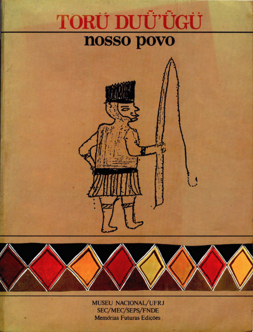

# Projeto 1 de APC 

Este projeto foi desenvolvido como parte da disciplina de Algoritmos e Programação (APC) da Universidade de Brasília (UnB).

O objetivo deste projeto foi desenvolver um algoritmo simples em Python que utiliza manipulação de strings para associar frases em português com suas traduções correspondentes em Ticuna. As frases usadas foram extraídas do primeiro capítulo do livro TORÜ DUǕ'ǕGÜ (Nosso Povo). O algoritmo imprime as traduções no terminal, facilitando a visualização e o estudo das correspondências entre os dois idiomas.

## O problema
Atualmente, a maioria dos modelos de IA pré-treinados é otimizada para línguas indo-europeias, o que limita sua aplicação para línguas menos representadas, como o Ticuna. Isso dificulta a tradução e o desenvolvimento de tecnologias de IA generativa para essas línguas.
## A solução
Desenvolver um programa que associe frases do texto em português à sua tradução em Ticuna pode ajudar a superar esse desafio. Essa solução poder ser útil na criação e implementação de modelos de IA generativa adaptados para a língua Ticuna, promovendo a construção de tecnologias mais inclusivas e representativas, ampliando o acesso para essas línguas.

## Executar a Aplicação
1. Clonar o Repositório:

    Utilize o Git para clonar o repositório para sua máquina local. Execute o seguinte comando no terminal:

    git clone https://github.com/JoaoJorgedosAnjos/projeto-01.git
2. Acessar o Diretório do Projeto:
    
   Navegue até o diretório do projeto clonado:
   
   cd projeto-01
3. Executar a Aplicação:

   python3 projeto_01.py

## Integrantes
### Alunos
- João Jorge
- Natalie Santos 
- Patrícia Tayná
### Professores
- Profª Maristela Holanda
- Prof. Edison Ishikawa
